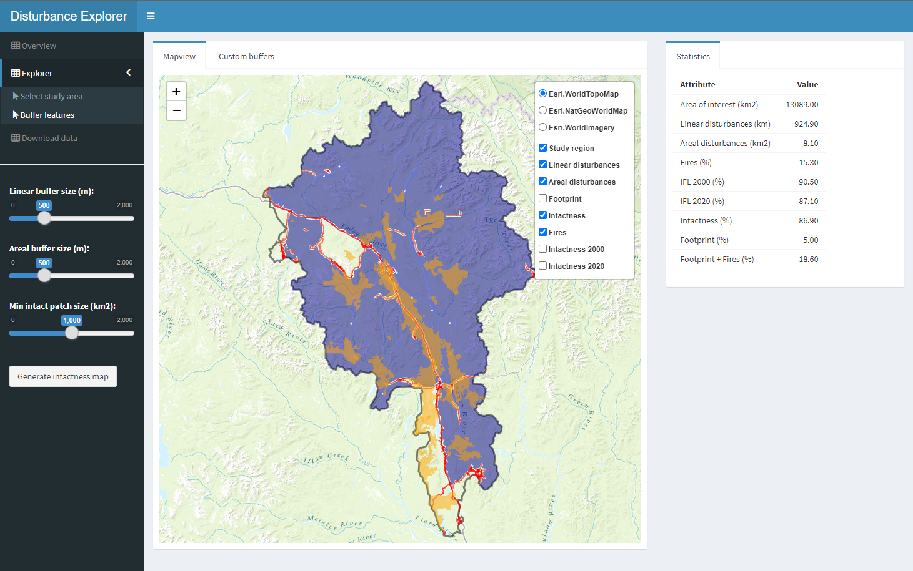

## Disturbance Explorer

April 24, 2025

The Disturbance Explorer is an R shiny app that enables users to generate human footprint or landscape intactness maps using regional-scale anthropogenic surface disturbance data. The app includes the following functionality:

-   Upload anthropogenic disturbances (linear and areal) and an area of interest (AOI) as a geopackage
-   Calculate the regional human footprint (or landscape intactness) applying user-defined buffers of influence around linear or areal disturbances
-   Save footprint and intactness maps as a geopackage for use in QGIS or ArcGIS

The app is located at: <https://beaconsproject.shinyapps.io/disturbance_explorer>

The app can also be run from a local machine using the following steps (note, the first 2 steps only need to be run once):

1.  Install R (download from [r-project.org](https://www.r-project.org/) and follow instructions)
2.  Install the following additional packages:

```         
install.packages(c("sf","leaflet","tidyverse","shinydashboard","shinycssloaders","shinyjs","markdown","shinyMatrix"))
```

3.  Start the Shiny app:

```         
shiny::runGitHub("beaconsproject/disturbance_explorer")
```


