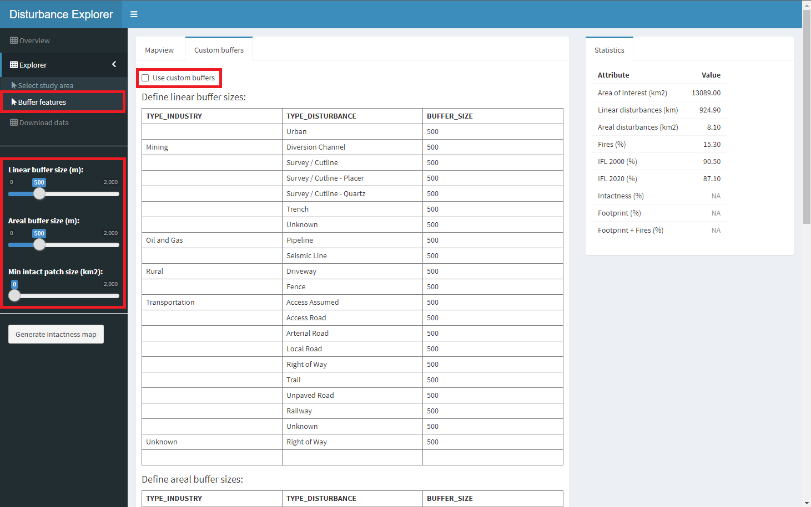
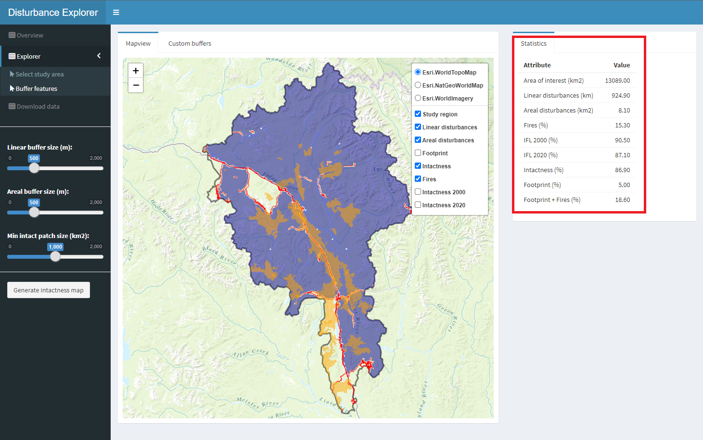
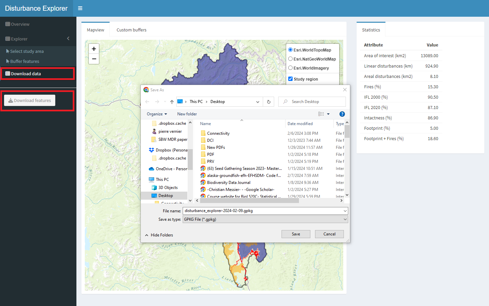

# Buffer features

The **Buffer features** enables users to apply influence buffers around linear and polygonal (areal) disturbances features. 
Users have two options:

  - Apply an overall buffer on the respective layers using sliders, or 
  - Enable custom buffer sizes based on industry and feature types. 
To access the custom buffer table, check the 'Use custom buffers' box — this will switch the map view to display the table. Value inside the 'BUFFER_SIZE' column can be edited.

 Figure 3. Custom buffer table generated by user specified disturbance industries and types.

In the left sidebar, minimum patch size of intactness areas can be set using the slider after the buffering on the disturbance features are applied. This function will remove every patch in the study area that are considered not sufficiently large to maintain key ecological processes.

The user can indicate the inclusion of fires and mining claims if present in the gpkg in the generation of footprint and intactness map. Minimum fire size and buffer size around mining claims need to be set prior to generet the maps.  

 Figure 4. Inclusion of fires and mining claims.

## View map

After a few seconds to a minute, two new layers will appear in the map and legend: a "footprint" layer that shows the human influence on the landscape and an "intactness" layer which shows the distribution of intact areas in the landscape.

 Figure 5. Mapping footprint and intactness layers.

## View statistics

The "Statistics" tab on the right panel provides regional estimates of intactness. 
When Intact Forest Landscapes for the years 2000 and 2020 are provided, the user can see comparison of its generated intactness layers to those two. 
The areal extent of burned areas are also shown.

 Figure 6. Statistics on generated footprint and intactness.

