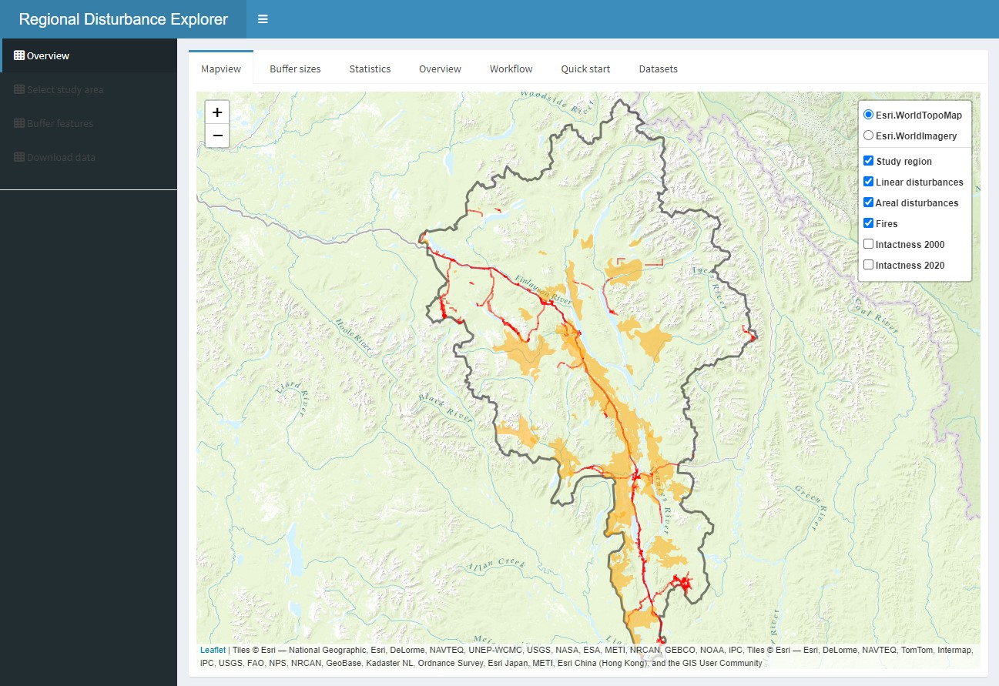

## Introduction

The purpose of the Regional Disturbance Explorer app is to enable users to interactively create a landscape intactness map or, conversely, a human footprint map. The app also allows users to assess the influence of buffer size and minimum patch size on the resulting intactness and footprint maps. Currently, the app can only be used using the demo dataset for a watershed in the southeast Yukon that is included. The dataset is described below. A future release will enable users to use their own regional disturbance data and will include instructions on how to do so. 

  
     
    Figure 1. Shiny-based disturbance explorer app.
  

    
## Functionality
    
The app consists of four sections:
    
**Overview**:
    
- Provides a description of the app, its functionality, and the demo datasets.
  
**Select an area of interest**:
    
  - Select an existing fundamental drainage area (FDA)
  - Upload an area of interest (AOI) polygon as a geopackage ('.gpkg')
  
If you upload an area of interest, the projection must be EPSG:3578 (NAD83 / Yukon Albers). Moreover, in order to generate intactness and footprint maps, the uploaded polygon must overlay the data extent provided within the app.
  
**Buffer disturbance features and calculate footprint and intactness**:
    
  - view linear and areal anthropogenic surface disturbances, forest fires, and mining claims 
  - apply a custom buffer around the disturbance features
  - set a minimum patch size of intactness areas after the buffering on the disturbance features are applied. This function will remove every patch in the AOI that are considered not sufficiently large to maintain key ecological processes
  - compare regional estimates of intactness to those provided by Intact Forest Landscapes for the years 2000 and 2020
  
**Save footprint and intactness maps**:
    
  - view a map of intactness that contain only patches that reach the minimum size of intactness areas
  - view a map of the buffered footprint 
  - explore the proportion of intactness and footprint
  
## Input data
  
The key input data is the regional disturbance dataset. Currently, only open source file geopackages ("gpkg") can be used. The demo datasets include several fundamental drainage areas (watersheds) located in the Yukon and British Columbia. For a description of the data layers and attributes required by the app, go to the **Datasets** tab.  

