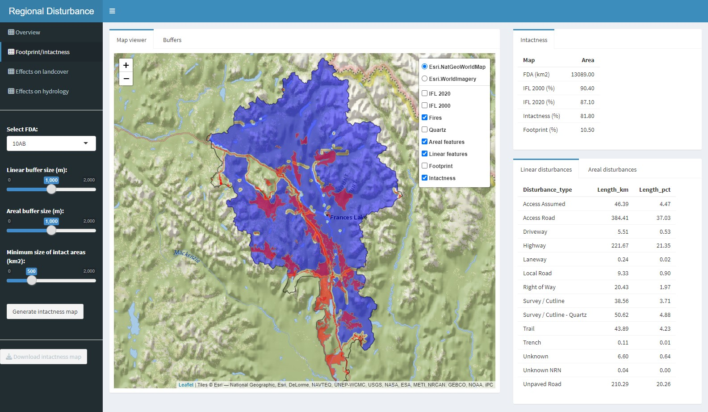

# Regional Disturbance Explorer

## Introduction

The purpose of the Regional Disturbance Explorer app is to enable users to interactively create a landscape intactness map or, conversely, a human footprint map. The app also allows users to assess the influence of buffer size and minimum patch size on the resulting intactness and footprint maps. Currently, the app can only be used using the demo dataset for a watershed in the southeast Yukon that is included. The dataset is described below. A future release will enable users to use their own regional disturbance data and will include instructions on how to do so. 

 
Figure 1. Shiny-based disturbance explorer app.

## Functionality

The app consists of four sections:

1. **Overview**:
  - Provides a description of the app, its functionality, and the demo datasets.

2. **Footprint/intactness**:
  - view linear and areal anthropogenic surface disturbances, forest fires, and mining claims
  - view a summary of the length or area of each disturbance type that occurs in the region - with or without buffers
  - compare regional estimates of intactness to those provided by Intact Forest Landscapes for the years 2000 and 2020

3. **Effects on landcover**:
  - view the distribution of landcover in the region
  - view a table showing the area of individual landcover types along with an estimate of the proportion that is affected by anthropogenic disturbances
  - select landcover type to view a map showing its distribution along with buffered disturbances

4. **Effects on hydrology**:
  - view a map of streams, rivers, and lakes
  - view a table showing length and areas of streams, rivers, and lakes
  - explore the proportion of streams, rivers, and lakes are within a user-defined distance of anthropogenic disturbances

## Input data

### Regional disturbance map

The key input data is the regional disturbance dataset. Currently, only open source file geopackages ("gpkg") can be used. The demo datasets (fda_10ab.gpkg and fda_09ea.gpkg) are from fundamental drainage areas (watersheds) located in the Yukon. They include the following layers. A vignette will soon be available describing how users can create a similar dataset for another region.

The **fda_10ab.gpkg** geopackage includes the following layers:

  - FDA
  - IFL_2000
  - IFL_2020
  - Fire_History
  - Quartz_Claims
  - Areal_Features
  - Linear_Features

The **Areal_Features** layer includes the following attributes:

- TYPE_INDUSTRY
- TYPE_DISTURBANCE
- CREATED_BY
- IMAGE_DATA
- Area_ha

The **Linear_Features** layer includes the following attributes:

- TYPE_INDUSTRY
- TYPE_DISTURBANCE
- CREATED_BY
- IMAGE_DATA
- Length_km

### Landcover map

**Land cover 2019**. High-resolution (30m) annual forest land cover maps for Canada's forested ecosystems. Land cover maps for the years 1984-2019 can be downloaded from https://opendata.nfis.org/mapserver/nfis-change_eng.html

### Hydrology data

**Fundamental drainage areas**. Consists of many hydrology layers including streams, rivers, and lakes for each fundamental drainage area (FDA) in Canada. The FDA data can be downloaded from https://open.canada.ca/data/en/dataset/a4b190fe-e090-4e6d-881e-b87956c07977
