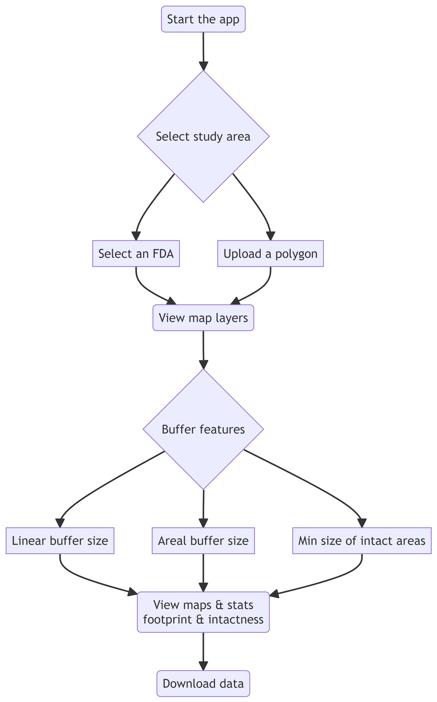

## Welcome to Disturbance Explorer 

Understanding human activity is essential for effective conservation planning, land management, and ecological research. Undisturbed areas, often referred to as 
intact landscapes, are critical for maintaining biodiversity, supporting ecosystem services, and preserving ecological integrity. Conversely, identifying disturbed 
areas—such as those affected by roads, industrial activities, or fires—helps quantify human impact and guides conservation efforts.

**Disturbance Explorer** produces custom maps of undisturbed and disturbed landscapes with tools to explore the influence of buffer size (or zone of influence), minimum patch size, fire, and potential future disturbances (e.g., mining claims) on these landscapes.
Users can explore the influence of buffer size and minimum patch size on the resulting undisturbed and disturbed area maps. 

The **Welcome** section includes the **Overview** landing page that provides a concise introduction to the app and its functionality. It also includes this guide and **Dataset Requirements** 
which outlines the description, naming convention, and data structure of the required spatial layers used by the **Disturbance Explorer** app. 

Guidance is integrated directly into the workflow: each step includes a User Guide tab with clear instructions and explanations of functions. 

### Input data
  
**Disturbance Explorer** relies on several key spatial layers contained within a single GeoPackage. A demo dataset is included with the app for a watershed in southeast Yukon, Canada. Users may upload their own GeoPackage, provided it follows the required structure. 
Please refer to the **Dataset Requirements** tab for details on the required spatial layers and associated attributes and formatting.

### Functionality
    
The app consists of four sections. To get started, click 'Select study area' on the left-side panel. 
 

#### Select study area

  - Use the demo dataset or upload a custom GeoPackage ("gpkg" extension) containing all required spatial layers. Additional linear and areal disturbance features can be uploaded as shapefiles. 
These can be incorporated into the mapping process or used for viewing purposes only.
    
  - View the spatial layers (i.e., linear and areal human disturbances, fires, mining claims, etc.)

📌 Note: All layers in the GeoPackage must have the same projection. Additionally, the study area must capture the full extent of disturbance layers to ensure accurate analysis.
 

#### Add display elements (OPTIONAL)

This section allows users to add additional features for visualization. These features can be vector data (points, lines, or polygons) as well as rasters. 
The file or layer names are automatically used as display names on the map. Colors are assigned by the app and cannot be modified.

 

#### Buffer features

This section defines how disturbance features influence the landscape by applying buffers (zones of influence) and including additional disturbance layers.
 
  - Choose how to apply buffers to disturbance features:
    
    - A uniform buffer size applied to all features, or

    - Custom buffer sizes specific to disturbance types.

  - (Optional) Set a minimum patch size for undisturbed areas after buffering. Smaller patches will be removed. Default is 0 km2.
  
  - (Optional) Include other linear and areal disturbances not in the GeoPackage, such as future disturbances (e.g., proposed road network and/or cutblocks) or natural disturbances other than fire (e.g., insect outbreaks) and specify a buffer (only if other linear and/or areal disturbances data are provided).

  - (Optional) Include mining claims and specify a buffer (only if mining data are provided).

  - (Optional) Include fires and specify a minimum size threshold and the years to include (only if fires data are provided)..

 
#### Download undisturbed and disturbed areas
    
  - Download a GeoPackage of the **undisturbed areas** and **disturbed areas** created by the app, as well as the input spatial layers (e.g., linear and areal disturbances).
  
### Disturbance Explorer workflow diagram

The worflow diagram below provides an overview of the process.

  

  
