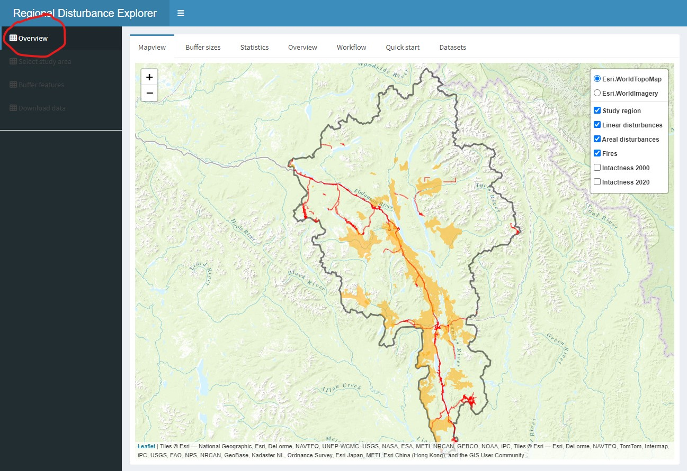
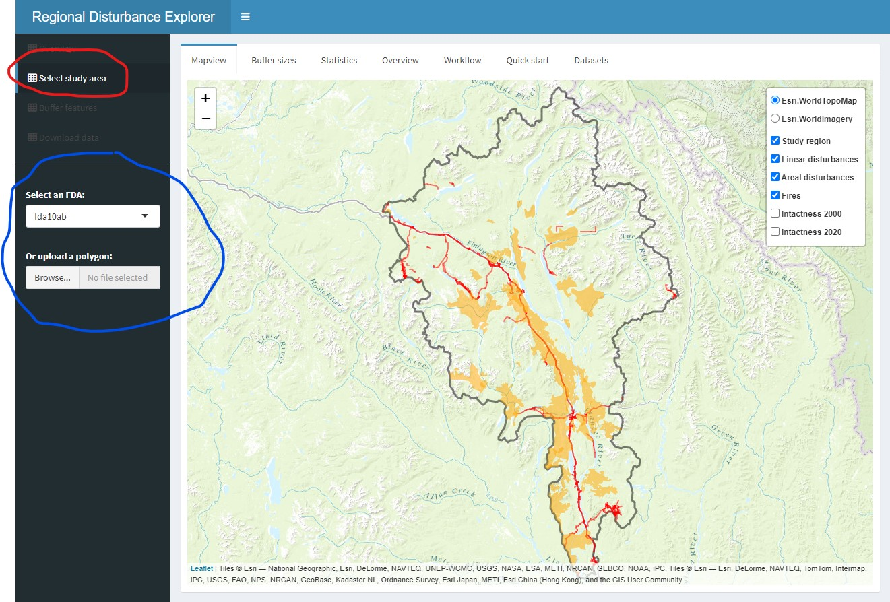
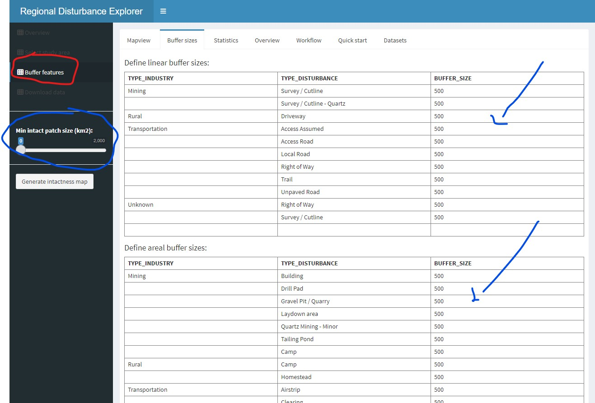
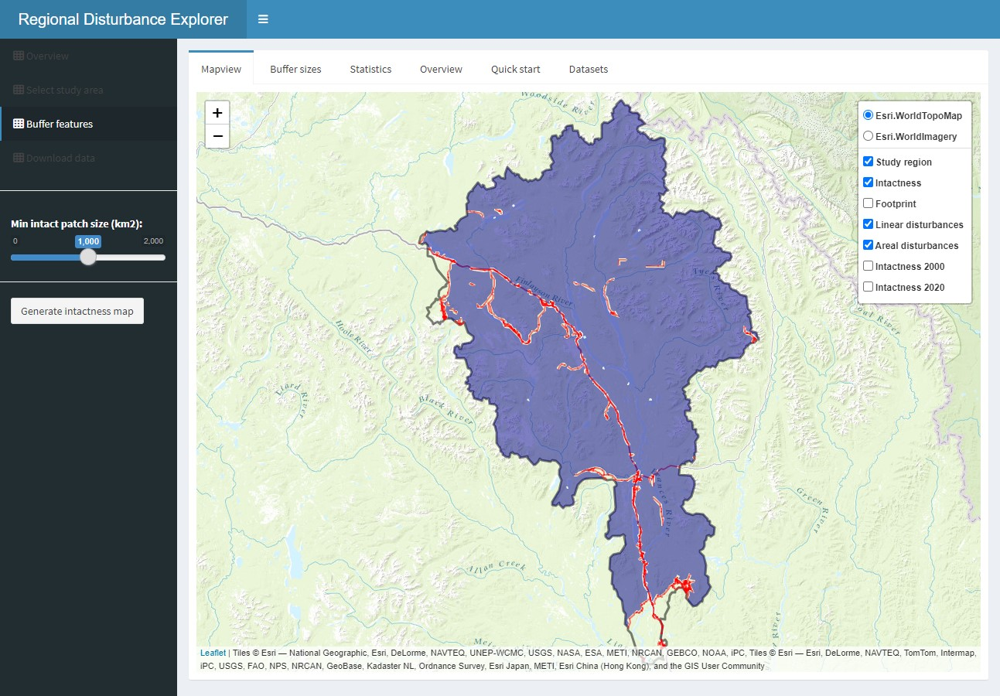
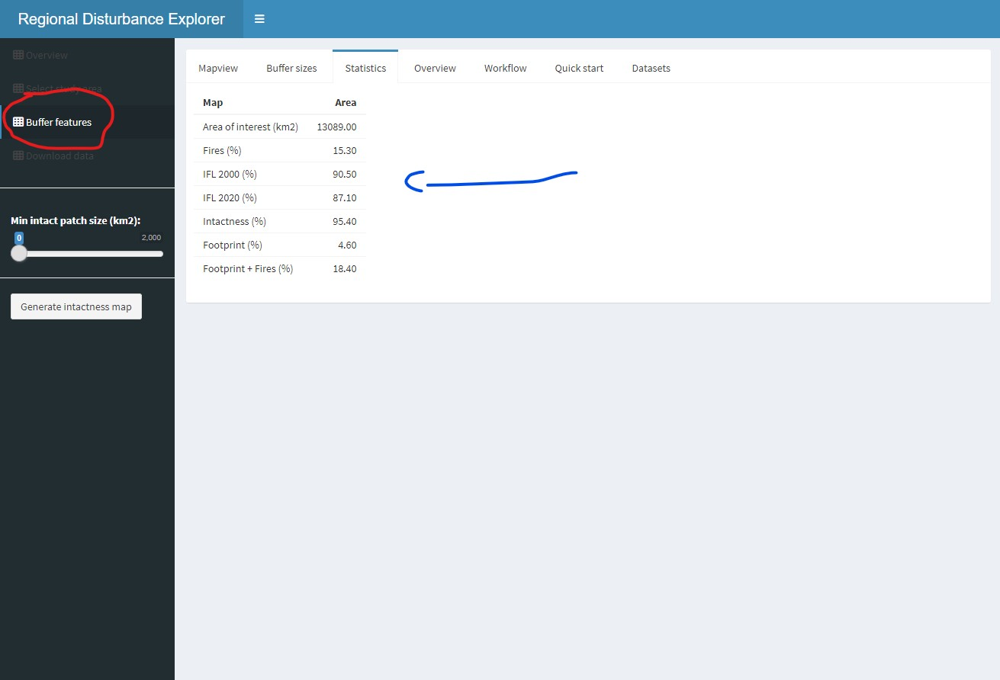
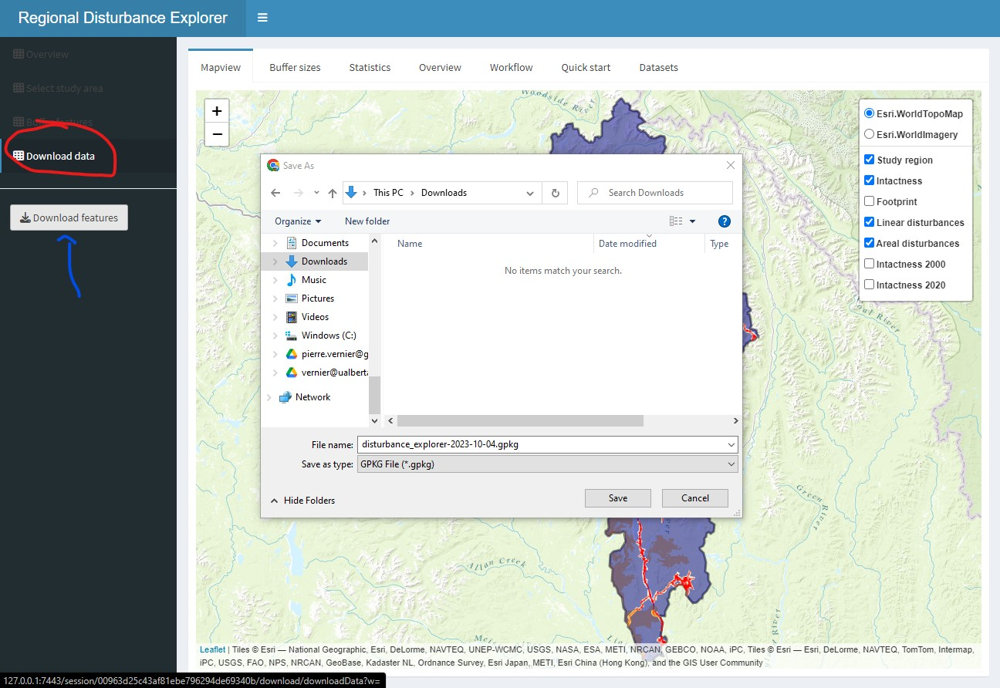

## Workflow

The purpose of the Regional Disturbance Explorer app is to enable users to interactively create a landscape intactness map or, conversely, a human footprint map. The app also allows users to assess the influence of buffer size and minimum patch size on the resulting intactness and footprint maps. This page provides a "quick start" to using the app by describing the main functions of the app. The worflow diagram below provides an overview of the process.

## Overview

The Overview section provides a description of the app, its functionality, and the demo datasets. You can start using the app by turning on and off the various layers in the map legend.

 Figure 1. Shiny-based disturbance explorer app.

## Select study area

Click on "Select study area" to change the area of interest dataset. You have two choices:

  - Select an existing fundamental drainage area (FDA). This will include all the layers needed to run the app.
  - Upload a user-defined study area as a geopackage ('.gpkg'). In this case, the onus is on the user to ensure that all the required layers are included, and that the projection is sest to EPSG:3578 (NAD83 / Yukon Albers). See the **Datasets** tab for more details about required layers.

 Figure 1. Shiny-based disturbance explorer app.

## Buffer features

Click on the "Buffer sizes" tab to apply buffers of influence around linear and areal (polygonal) feature types. Simply edit the values in the "BUFFER_SIZE" column.

In the left sidebar, you can also set a minimum patch size of intactness areas after the buffering on the disturbance features are applied. This function will remove every patch in the study area that are considered not sufficiently large to maintain key ecological processes
  

 Figure 1. Shiny-based disturbance explorer app.

### View map

After a few seconds to a minute, two new layers will appear in the map and legend: a "footprint" layer that shows the human influence on the landscape and an "intactness" layer which shows the distribution of intact areas in the landscape.

 Figure 1. Shiny-based disturbance explorer app.

### View statistics

If you click on the "Statistic" tab, you will be able to compare regional estimates of intactness to those provided by Intact Forest Landscapes for the years 2000 and 2020. The areal extent of burned areas are also shown.

 Figure 1. Shiny-based disturbance explorer app.

### Download data

Finally, you can click on "Download data" in the left sidebar to save the footprint and intactness layers to a GeoPackage format which can be further viewed and analysed in a GIS e.g., QGIS.

 Figure 1. Shiny-based disturbance explorer app.

