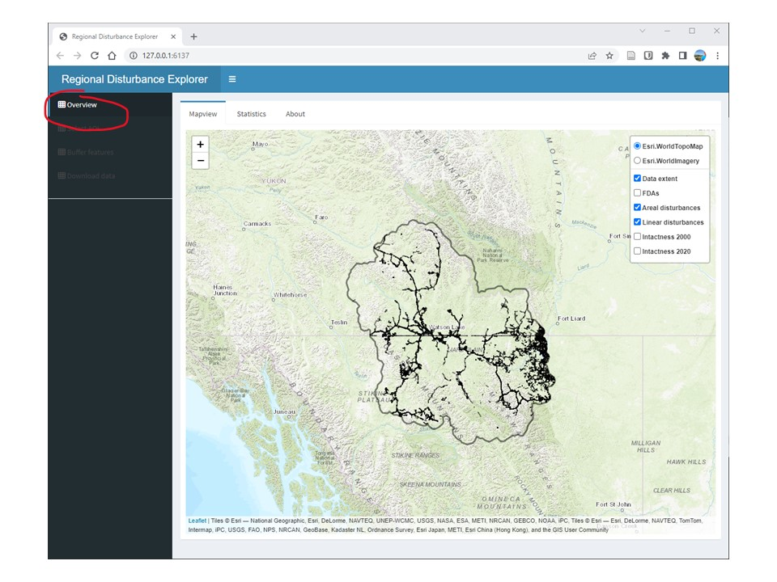
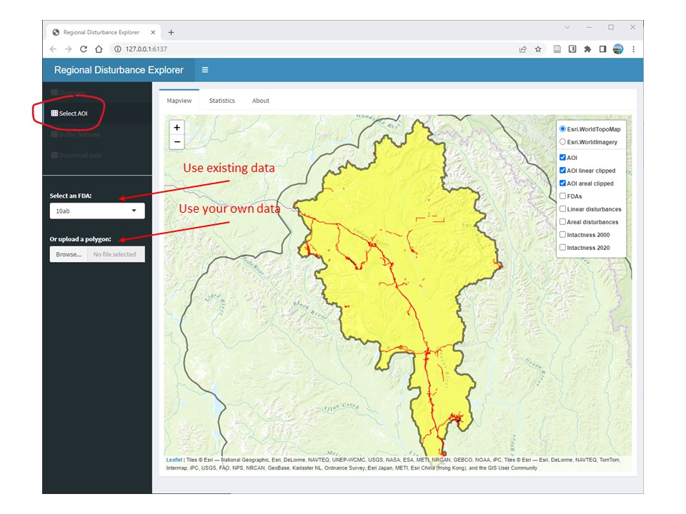
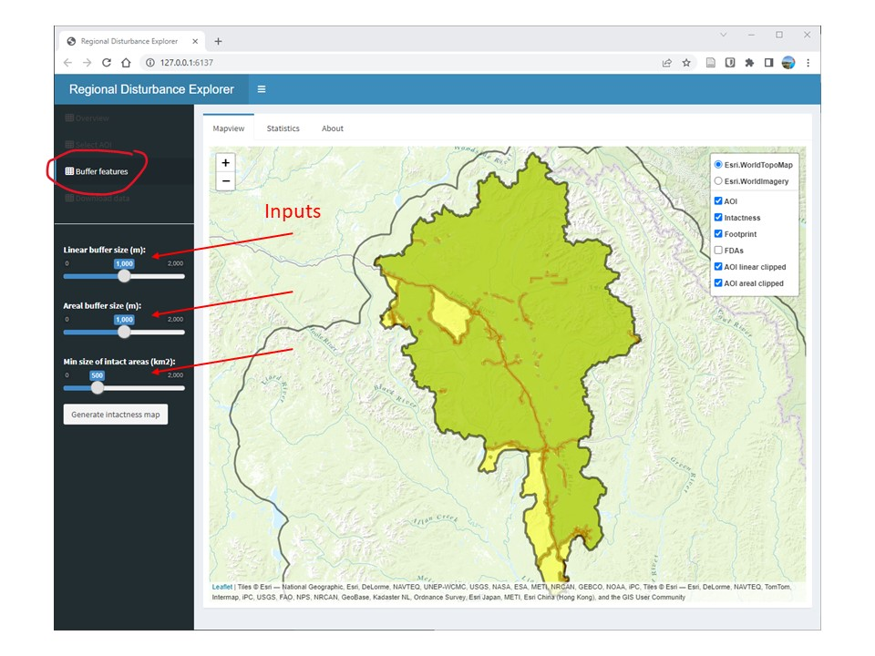
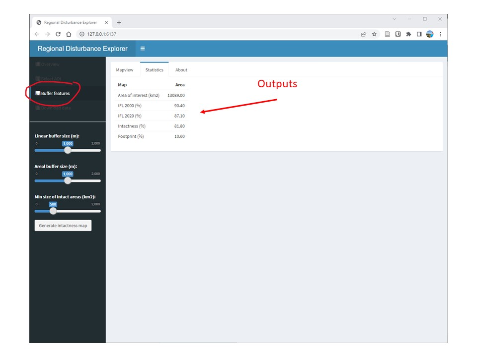
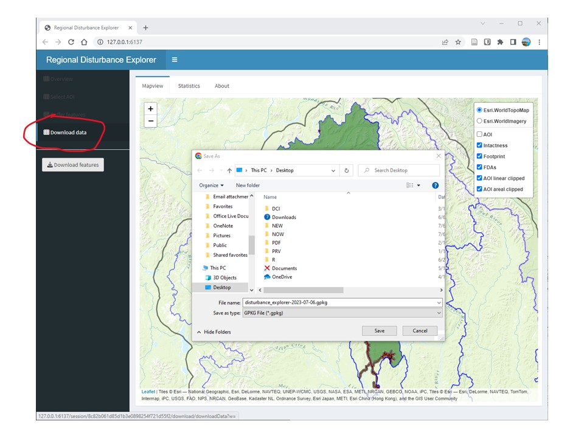

## Overview

The purpose of the Regional Disturbance Explorer app is to enable users to interactively create a landscape intactness map or, conversely, a human footprint map. The app also allows users to assess the influence of buffer size and minimum patch size on the resulting intactness and footprint maps. This page provides a "quick start" to using the app by describing the main functions of the app.

The Overview section provides a description of the app, its functionality, and the demo datasets. You can start using the app by turning on and off the various layers in the map legend.

 Figure 1. Shiny-based disturbance explorer app.

## Select AOI

Click on "Select AOI" to change the area of interest dataset. You have two choices:

  - Select an existing fundamental drainage area (FDA)
  - Upload an area of interest (AOI) polygon as a geopackage ('.gpkg')
  
If you upload an area of interest, the projection must be EPSG:3579 (NAD83(CSRS) / Yukon Albers). Moreover, in order to generate intactness and footprint maps, the uploaded polygon must overlay the data extent provided within the app.

 Figure 1. Shiny-based disturbance explorer app.

## Buffer features

Click on "Buffer features" in the left sidebar to apply buffers of influence around linear and areal (polygonal) features. Three sliders will appear:

  - apply a buffer around disturbance features
  - apply a buffer around areal disturbance features
  - set a minimum patch size of intactness areas after the buffering on the disturbance features are applied. This function will remove every patch in the AOI that are considered not sufficiently large to maintain key ecological processes

### View map

After a few seconds to a minute, two new layers will appear in the map and legend: a "footprint" layer that shows the human influence on the landscape and an "intactness" layer which shows the distribution of intact areas in the landscape.

 Figure 1. Shiny-based disturbance explorer app.

### View statistics

If you click on the "Statistic" tab, you will be able to compare regional estimates of intactness to those provided by Intact Forest Landscapes for the years 2000 and 2020. The areal extent of burned areas are also shown.

 Figure 1. Shiny-based disturbance explorer app.

### Download data

Finally, you can click on "Download data" in the left sidebar to save the footprint and intactness layers to a GeoPackage format which can be further viewed and analysed in a GIS e.g., QGIS.

 Figure 1. Shiny-based disturbance explorer app.

