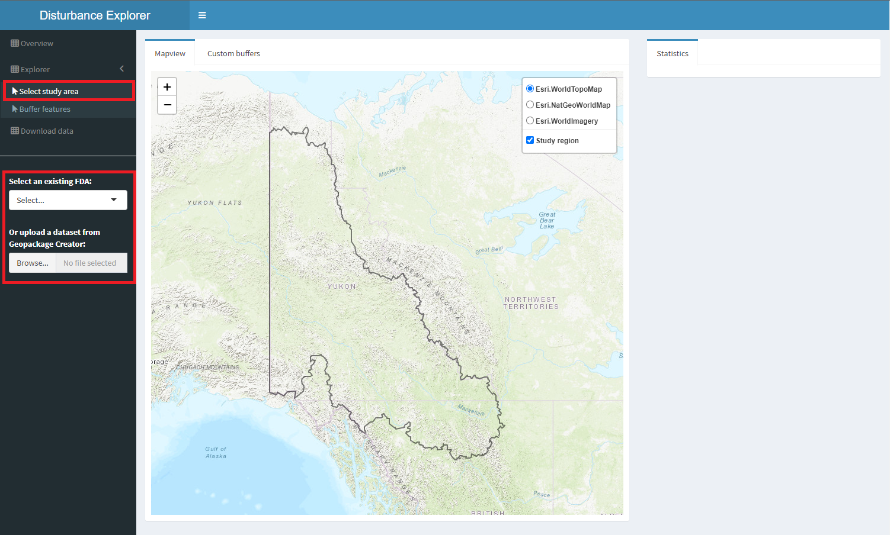

# Select study area

Click on **Select study area** to begin. You have two options:

  - Use demo dataset (which is embedded in the app). This dataset includes all the necessary layers to run the application and represents the fundamental drainage area 10AB, located in the Yukon and British Columbia.
  - Upload a custom GeoPackage ('.gpkg'). When using your own dataset, you are responsible for ensuring that all required layers are included and that all layers share a consistent coordinate reference system. Refer to the Datasets tab for a detailed description of required and optional layers.

If a user-defined GeoPackage is uploaded, the app provides an option to classify linear and areal disturbances by industry and type. This classification generates a table used in the next step to assign custom buffer sizes for each industry/type combination.

 Figure 2. Mapping study area and underlying dataset.

Confirming the source dataset loads the study area along with its underlying layers, allowing you to toggle individual layers on and off in the map legend.

